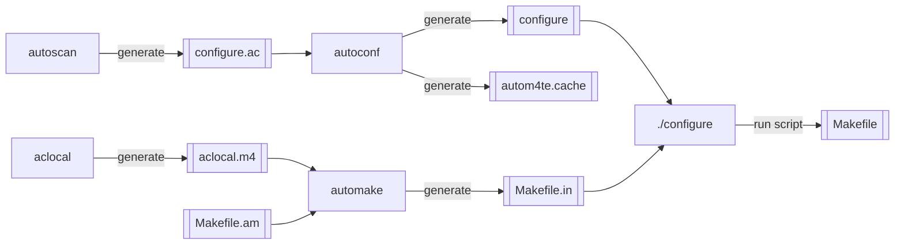
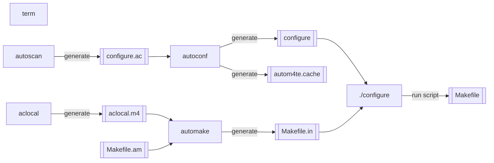

# Autotool 사용법

flow sequence



```
	
autoscan --generate--> configure.ac[[configure.ac]]
configure.ac --> autoconf
autoconf --generate--> configure[[configure]]
autoconf --generate--> autom4te.cache[[autom4te.cache]]

aclocal --generate--> aclocal.m4[[aclocal.m4]]

aclocal.m4 --> automake
Makefile.am[[Makefile.am]] --> automake
automake --generate--> Makefile.in[[Makefile.in]]

configure --> ./configure
Makefile.in --> ./configure

./configure --run script--> Makefile[[Makefile]]
```




## autoscan

하위 폴더를 검색하여 `configure.scan` 파일을 생성하며 이 파일을 `configure.ac` 로 이름을 변경해서 사용한다.

`configure.ac` 파일을 열어 대괄호로 묶여있는 변수에 적절한 값을 채워 넣어야 한다.

## autoconf

`configure` 스크립트를 생성한다(동시에 `autom4te.cache` 파일도 생성한다).

이 과정을 위해서 `configure.ac` 파일이 필요하다.

## aclocal

automake를 하기 위해 필요한 `aclocal.m4`파일을 생성한다. 이 파일에는 automake에서 사용하는 Macro에 대한 내용이 있다.

## automake

`Makefile`을 만드는데 필요한 `Makefile.in`파일을 생성한다.

automake명령어를 수행하게 되면 `Makefile.am`파일을 참고해서 `Makefile.in` 파일을 생성한다.

`Makefile.am`은 프로그래머가 작성해 주어야 하는 파일이며 해당 프로젝트에 해당 하는 정보를 기술해 주는 파일이다.

이 파일은 프로젝트의 모든 디렉터리마다 작성해 주어야 하며, 디렉토리에 소스코드가 없으면 'SUBDIRS'만 쓰면 된다.

`Makefile.am`의 예시는 다음과 같다.

```makefile
bin_PROGRAMS = application
SUBDITS = core utils
application_SOURCES = main.c util.c core.c

AM_CFLAGS = -Wall -g
application_LDADD =
application_LDFLAGS = -lm -lpthread -ldl
```

### autoreconf

automake 과정에서 `config.h.in` 파일이 없다고 오류가 나면 autoreconf 명령어를 수행한다.

`config.h.in` 파일이 생성된다.

### automake --add-missing

## ./configure

autoconf로 생성한 `configure` 를 생성한다. 이 스크립트는 automake로 생성한 `Makefile.in`을 참고해서 Makefile을 만들어 준다(중간 과정에서 `config.status` 파일이 생성된다).
