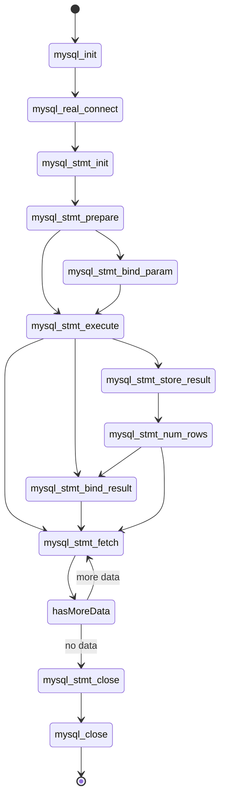
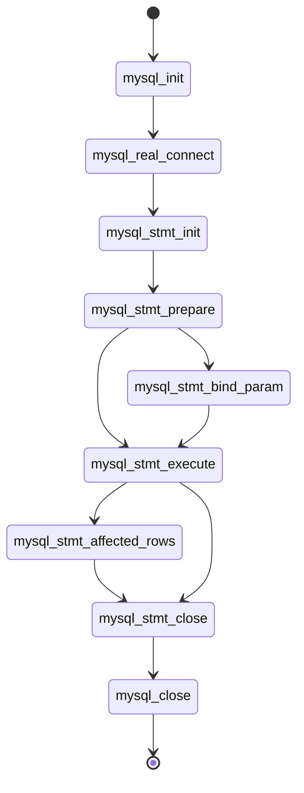

# Api Flow

## Select Statement

### Flow




### Example Code

https://dev.mysql.com/doc/c-api/5.7/en/mysql-stmt-fetch.html

```c
#define STRING_SIZE 50

#define SELECT_SAMPLE "SELECT col1, col2, col3, col4 \
                       FROM test_table"

MYSQL_STMT    *stmt;
MYSQL_BIND    bind[4];
MYSQL_RES     *prepare_meta_result;
MYSQL_TIME    ts;
unsigned long length[4];
int           param_count, column_count, row_count;
short         small_data;
int           int_data;
char          str_data[STRING_SIZE];
my_bool       is_null[4];
my_bool       error[4];

/* Prepare a SELECT query to fetch data from test_table */
stmt = mysql_stmt_init(mysql);
if (!stmt)
{
  fprintf(stderr, " mysql_stmt_init(), out of memory\n");
  exit(0);
}
if (mysql_stmt_prepare(stmt, SELECT_SAMPLE, strlen(SELECT_SAMPLE)))
{
  fprintf(stderr, " mysql_stmt_prepare(), SELECT failed\n");
  fprintf(stderr, " %s\n", mysql_stmt_error(stmt));
  exit(0);
}
fprintf(stdout, " prepare, SELECT successful\n");

/* Get the parameter count from the statement */
param_count= mysql_stmt_param_count(stmt);
fprintf(stdout, " total parameters in SELECT: %d\n", param_count);

if (param_count != 0) /* validate parameter count */
{
  fprintf(stderr, " invalid parameter count returned by MySQL\n");
  exit(0);
}

/* Execute the SELECT query */
if (mysql_stmt_execute(stmt))
{
  fprintf(stderr, " mysql_stmt_execute(), failed\n");
  fprintf(stderr, " %s\n", mysql_stmt_error(stmt));
  exit(0);
}

/* Fetch result set meta information */
prepare_meta_result = mysql_stmt_result_metadata(stmt);
if (!prepare_meta_result)
{
  fprintf(stderr,
         " mysql_stmt_result_metadata(), \
           returned no meta information\n");
  fprintf(stderr, " %s\n", mysql_stmt_error(stmt));
  exit(0);
}

/* Get total columns in the query */
column_count= mysql_num_fields(prepare_meta_result);
fprintf(stdout,
        " total columns in SELECT statement: %d\n",
        column_count);

if (column_count != 4) /* validate column count */
{
  fprintf(stderr, " invalid column count returned by MySQL\n");
  exit(0);
}

/* Bind the result buffers for all 4 columns before fetching them */

memset(bind, 0, sizeof(bind));

/* INTEGER COLUMN */
bind[0].buffer_type= MYSQL_TYPE_LONG;
bind[0].buffer= (char *)&int_data;
bind[0].is_null= &is_null[0];
bind[0].length= &length[0];
bind[0].error= &error[0];

/* STRING COLUMN */
bind[1].buffer_type= MYSQL_TYPE_STRING;
bind[1].buffer= (char *)str_data;
bind[1].buffer_length= STRING_SIZE;
bind[1].is_null= &is_null[1];
bind[1].length= &length[1];
bind[1].error= &error[1];

/* SMALLINT COLUMN */
bind[2].buffer_type= MYSQL_TYPE_SHORT;
bind[2].buffer= (char *)&small_data;
bind[2].is_null= &is_null[2];
bind[2].length= &length[2];
bind[2].error= &error[2];

/* TIMESTAMP COLUMN */
bind[3].buffer_type= MYSQL_TYPE_TIMESTAMP;
bind[3].buffer= (char *)&ts;
bind[3].is_null= &is_null[3];
bind[3].length= &length[3];
bind[3].error= &error[3];

/* Bind the result buffers */
if (mysql_stmt_bind_result(stmt, bind))
{
  fprintf(stderr, " mysql_stmt_bind_result() failed\n");
  fprintf(stderr, " %s\n", mysql_stmt_error(stmt));
  exit(0);
}

/* Now buffer all results to client (optional step) */
if (mysql_stmt_store_result(stmt))
{
  fprintf(stderr, " mysql_stmt_store_result() failed\n");
  fprintf(stderr, " %s\n", mysql_stmt_error(stmt));
  exit(0);
}

/* Fetch all rows */
row_count= 0;
fprintf(stdout, "Fetching results ...\n");
while (!mysql_stmt_fetch(stmt))
{
  row_count++;
  fprintf(stdout, "  row %d\n", row_count);

  /* column 1 */
  fprintf(stdout, "   column1 (integer)  : ");
  if (is_null[0])
    fprintf(stdout, " NULL\n");
  else
    fprintf(stdout, " %d(%ld)\n", int_data, length[0]);

  /* column 2 */
  fprintf(stdout, "   column2 (string)   : ");
  if (is_null[1])
    fprintf(stdout, " NULL\n");
  else
    fprintf(stdout, " %s(%ld)\n", str_data, length[1]);

  /* column 3 */
  fprintf(stdout, "   column3 (smallint) : ");
  if (is_null[2])
    fprintf(stdout, " NULL\n");
  else
    fprintf(stdout, " %d(%ld)\n", small_data, length[2]);

  /* column 4 */
  fprintf(stdout, "   column4 (timestamp): ");
  if (is_null[3])
    fprintf(stdout, " NULL\n");
  else
    fprintf(stdout, " %04d-%02d-%02d %02d:%02d:%02d (%ld)\n",
                     ts.year, ts.month, ts.day,
                     ts.hour, ts.minute, ts.second,
                     length[3]);
  fprintf(stdout, "\n");
}

/* Validate rows fetched */
fprintf(stdout, " total rows fetched: %d\n", row_count);
if (row_count != 2)
{
  fprintf(stderr, " MySQL failed to return all rows\n");
  exit(0);
}

/* Free the prepared result metadata */
mysql_free_result(prepare_meta_result);


/* Close the statement */
if (mysql_stmt_close(stmt))
{
  /* mysql_stmt_close() invalidates stmt, so call          */
  /* mysql_error(mysql) rather than mysql_stmt_error(stmt) */
  fprintf(stderr, " failed while closing the statement\n");
  fprintf(stderr, " %s\n", mysql_error(mysql));
  exit(0);
}
```

## Insert/Update/Delete Statement

### Flow



### Insert Example

https://dev.mysql.com/doc/c-api/5.7/en/mysql-stmt-execute.html

```c
#define STRING_SIZE 50

#define DROP_SAMPLE_TABLE "DROP TABLE IF EXISTS test_table"
#define CREATE_SAMPLE_TABLE "CREATE TABLE test_table(col1 INT,\
                                                 col2 VARCHAR(40),\
                                                 col3 SMALLINT,\
                                                 col4 TIMESTAMP)"
#define INSERT_SAMPLE "INSERT INTO \
                       test_table(col1,col2,col3) \
                       VALUES(?,?,?)"

MYSQL_STMT    *stmt;
MYSQL_BIND    bind[3];
my_ulonglong  affected_rows;
int           param_count;
short         small_data;
int           int_data;
char          str_data[STRING_SIZE];
unsigned long str_length;
my_bool       is_null;

if (mysql_query(mysql, DROP_SAMPLE_TABLE))
{
  fprintf(stderr, " DROP TABLE failed\n");
  fprintf(stderr, " %s\n", mysql_error(mysql));
  exit(0);
}

if (mysql_query(mysql, CREATE_SAMPLE_TABLE))
{
  fprintf(stderr, " CREATE TABLE failed\n");
  fprintf(stderr, " %s\n", mysql_error(mysql));
  exit(0);
}

/* Prepare an INSERT query with 3 parameters */
/* (the TIMESTAMP column is not named; the server */
/*  sets it to the current date and time) */
stmt = mysql_stmt_init(mysql);
if (!stmt)
{
  fprintf(stderr, " mysql_stmt_init(), out of memory\n");
  exit(0);
}
if (mysql_stmt_prepare(stmt, INSERT_SAMPLE, strlen(INSERT_SAMPLE)))
{
  fprintf(stderr, " mysql_stmt_prepare(), INSERT failed\n");
  fprintf(stderr, " %s\n", mysql_stmt_error(stmt));
  exit(0);
}
fprintf(stdout, " prepare, INSERT successful\n");

/* Get the parameter count from the statement */
param_count= mysql_stmt_param_count(stmt);
fprintf(stdout, " total parameters in INSERT: %d\n", param_count);

if (param_count != 3) /* validate parameter count */
{
  fprintf(stderr, " invalid parameter count returned by MySQL\n");
  exit(0);
}

/* Bind the data for all 3 parameters */

memset(bind, 0, sizeof(bind));

/* INTEGER PARAM */
/* This is a number type, so there is no need
   to specify buffer_length */
bind[0].buffer_type= MYSQL_TYPE_LONG;
bind[0].buffer= (char *)&int_data;
bind[0].is_null= 0;
bind[0].length= 0;

/* STRING PARAM */
bind[1].buffer_type= MYSQL_TYPE_STRING;
bind[1].buffer= (char *)str_data;
bind[1].buffer_length= STRING_SIZE;
bind[1].is_null= 0;
bind[1].length= &str_length;

/* SMALLINT PARAM */
bind[2].buffer_type= MYSQL_TYPE_SHORT;
bind[2].buffer= (char *)&small_data;
bind[2].is_null= &is_null;
bind[2].length= 0;

/* Bind the buffers */
if (mysql_stmt_bind_param(stmt, bind))
{
  fprintf(stderr, " mysql_stmt_bind_param() failed\n");
  fprintf(stderr, " %s\n", mysql_stmt_error(stmt));
  exit(0);
}

/* Specify the data values for the first row */
int_data= 10;             /* integer */
strncpy(str_data, "MySQL", STRING_SIZE); /* string  */
str_length= strlen(str_data);

/* INSERT SMALLINT data as NULL */
is_null= 1;

/* Execute the INSERT statement - 1*/
if (mysql_stmt_execute(stmt))
{
  fprintf(stderr, " mysql_stmt_execute(), 1 failed\n");
  fprintf(stderr, " %s\n", mysql_stmt_error(stmt));
  exit(0);
}

/* Get the number of affected rows */
affected_rows= mysql_stmt_affected_rows(stmt);
fprintf(stdout, " total affected rows(insert 1): %lu\n",
                (unsigned long) affected_rows);

if (affected_rows != 1) /* validate affected rows */
{
  fprintf(stderr, " invalid affected rows by MySQL\n");
  exit(0);
}

/* Specify data values for second row,
   then re-execute the statement */
int_data= 1000;
strncpy(str_data, "
        The most popular Open Source database",
        STRING_SIZE);
str_length= strlen(str_data);
small_data= 1000;         /* smallint */
is_null= 0;               /* reset */

/* Execute the INSERT statement - 2*/
if (mysql_stmt_execute(stmt))
{
  fprintf(stderr, " mysql_stmt_execute, 2 failed\n");
  fprintf(stderr, " %s\n", mysql_stmt_error(stmt));
  exit(0);
}

/* Get the total rows affected */
affected_rows= mysql_stmt_affected_rows(stmt);
fprintf(stdout, " total affected rows(insert 2): %lu\n",
                (unsigned long) affected_rows);

if (affected_rows != 1) /* validate affected rows */
{
  fprintf(stderr, " invalid affected rows by MySQL\n");
  exit(0);
}

/* Close the statement */
if (mysql_stmt_close(stmt))
{
  /* mysql_stmt_close() invalidates stmt, so call          */
  /* mysql_error(mysql) rather than mysql_stmt_error(stmt) */
  fprintf(stderr, " failed while closing the statement\n");
  fprintf(stderr, " %s\n", mysql_error(mysql));
  exit(0);
}
```
