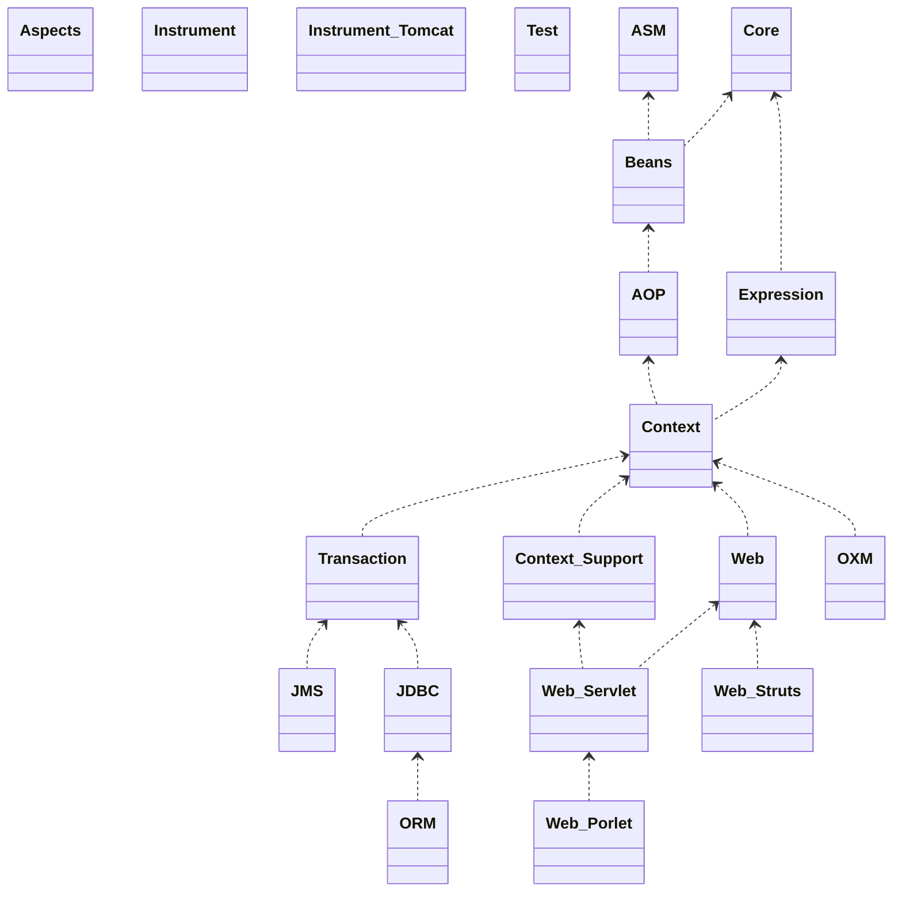

# Spring module dependency

스프링 필수 의존관계도

```mermaid
classDiagram
	class Aspects
	class Instrument
	class Instrument_Tomcat
	class Test
	
	
	ASM <.. Beans
	Core <.. Beans
	Beans <.. AOP
	Core <.. Expression
	AOP <.. Context
	Expression <.. Context
	
	Context <.. Transaction
	Transaction <.. JMS
	Transaction <.. JDBC
	JDBC <.. ORM

	Context <.. Context_Support
	Context_Support <.. Web_Servlet
	Web_Servlet <.. Web_Porlet
	Context <.. Web
	Web <.. Web_Servlet
	Web <.. Web_Struts
	
	Context <.. OXM

```
