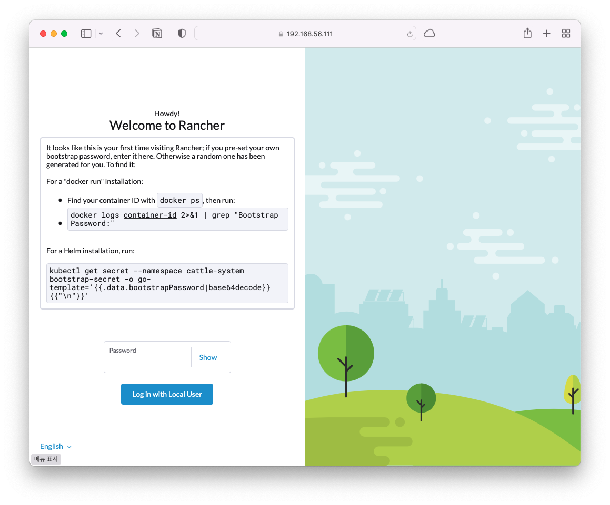

# Rancher Install

## Prerequisites

* [VirtualBox](https://www.virtualbox.org)
* [Vagrant](https://www.vagrantup.com)
* At least 4GB of free RAM

### Note

* Vagrant will require plugins to create VirtualBox VMs. Install them with the following commands:

```bash
vagrant plugin install vagrant-vboxmanage
```

```bash
vagrant plugin install vagrant-vbguest
```


## Configuration

> my local ip address `192.168.129.106`.

### Configuration Files

below code is bootstrap provision script for all VMs.


```bash
#!/bin/bash

# Enable ssh password authentication
echo "[TASK 1] Enable ssh password authentication"
sed -i 's/^PasswordAuthentication .*/PasswordAuthentication yes/' /etc/ssh/sshd_config
echo 'PermitRootLogin yes' >> /etc/ssh/sshd_config
systemctl reload sshd

# Set Root password
echo "[TASK 2] Set root password"
echo -e "kubeadmin\nkubeadmin" | passwd root >/dev/null 2>&1


# Set Rancher
apt-get update && apt-get install -y ca-certificates curl gnupg lsb-release
mkdir -m 0755 -p /etc/apt/keyrings
curl -fsSL https://download.docker.com/linux/ubuntu/gpg | sudo gpg --dearmor -o /etc/apt/keyrings/docker.gpg
echo "deb [arch=$(dpkg --print-architecture) signed-by=/etc/apt/keyrings/docker.gpg] https://download.docker.com/linux/ubuntu \
  $(lsb_release -cs) stable" | tee /etc/apt/sources.list.d/docker.list > /dev/null

apt-get update && apt-get install -y docker-ce docker-ce-cli containerd.io docker-buildx-plugin docker-compose-plugin
apt-get install -y vim net-tools

cat <<EOF > /etc/docker/daemon.json
{
    "insecure-registries" : [ "192.168.129.106:5001" ]
}
EOF

systemctl daemon-reload && systemctl restart docker
```



below `Vagrantfile` is generate 5 VMs(1 VM is for rancher, 4 VM is for k8s).

> Prepare at least 4GB of memory for Rancher.

VM network's range is `192.168.56.0/24`.


```ruby
# -*- mode: ruby -*-
# vi: set ft=ruby :

ENV['VAGRANT_NO_PARALLEL'] = 'yes'

Vagrant.configure("2") do |config|

  config.vm.provision "shell", path: "bootstrap.sh"
  
  config.vm.define "Rancher" do |rancher|
    rancher.vm.box = "ubuntu/focal64"
    rancher.vm.hostname = "rancher.example.com"
    rancher.vm.network "private_network", ip: "192.168.56.10"
    rancher.vm.provision "shell", inline: "docker run --privileged -d --restart=unless-stopped -p 80:80 -p 443:443 rancher/rancher"

    rancher.vm.provider "virtualbox" do |rv|
        rv.name = "rancher"
        rv.memory = 4096
        rv.cpus = 2
    end
  end
  
  NodeCount = 4

  # Kubernetes Nodes
  (1..NodeCount).each do |i|
    config.vm.define "node#{i}" do |node|

      node.vm.box = "ubuntu/focal64"
      node.vm.hostname = "node#{i}.example.com"
      node.vm.network "private_network", ip: "192.168.56.11#{i}"

      node.vm.provider "virtualbox" do |v|
        v.name = "node#{i}"
        v.memory = 2048
        v.cpus = 2
      end
    end
  end

end
```



VM Information

| hostname | cpus | memory(GiB) | IP             | Purpose    |
| -------- | ---- | ----------- | -------------- | ---------- |
| rancher  | 2    | 6           | 192.168.56.10  | Rancher    |
| node1    | 2    | 2           | 192.168.56.111 | k8s Master |
| node2    | 2    | 2           | 192.168.56.112 | k8s Master |
| node3    | 2    | 2           | 192.168.56.113 | k8s Worker |
| node4    | 2    | 2           | 192.168.56.114 | k8s Worker |


Empty VM List

<figure><figcaption><p>Empty VM List</p></figcaption></figure>


### Build VMs

build VMs. this command is take a few minutes.

```bash
vagrant up
```


Generated VM List

<figure><figcaption><p>Generated VM List</p></figcaption></figure>


## Repository in Host

In host machine, run docker registry.


```bash
sudo docker run -d -p 5001:5000 --restart always --name registry registry:2
```


after run registry, see below command:

```bash
curl 192.168.129.106:5001/v2/_catalog
```


## Run Rancher

### Rancher web

#### connect to rancher web (`http:192.168.56.10`) via web browser

<figure><figcaption></figcaption></figure>

#### check container id and find password


```bash
root@rancher:~# docker ps
docker CONTAINER ID   IMAGE             COMMAND           CREATED          STATUS          PORTS                                                                      NAMES
c5deb26bb7a1   rancher/rancher   "entrypoint.sh"   16 minutes ago   Up 16 minutes   0.0.0.0:80->80/tcp, :::80->80/tcp, 0.0.0.0:443->443/tcp, :::443->443/tcp   thirsty_shtern
root@rancher:~# 
root@rancher:~# 
root@rancher:~# 
root@rancher:~# docker logs c5de | grep Password
I0303 03:22:09.031183      32 leaderelection.go:248] attempting to acquire leader lease kube-system/cattle-controllers...
I0303 03:22:09.048776      32 leaderelection.go:258] successfully acquired lease kube-system/cattle-controllers
2023/03/03 03:22:09 [INFO] Bootstrap Password: sjq4vhgr79vdr9x6lksrhmctlrdg6wtk27z4vvkmgxhdl9rmb9pt2p
E0303 03:22:12.688027      32 gvks.go:69] failed to sync schemas: failed to sync cache for cluster.x-k8s.io/v1alpha3, Kind=Cluster
E0303 03:22:21.864510      32 request.go:977] Unexpected error when reading response body: context canceled
E0303 03:22:21.864732      32 gvks.go:69] failed to sync schemas: failed to sync cache for rke-machine.cattle.io/v1, Kind=LinodeMachineTemplate
E0303 03:22:22.405636      32 gvks.go:69] failed to sync schemas: failed to sync cache for rke-machine.cattle.io/v1, Kind=AzureMachineTemplate
E0303 03:22:23.015232      32 gvks.go:69] failed to sync schemas: failed to sync cache for rke-machine.cattle.io/v1, Kind=DigitaloceanMachine
root@rancher:~#
```



#### Set new password and continue

<figure><figcaption><p>Set new password</p></figcaption></figure>


Rancher main page

<figure><figcaption><p>welcome to rancher</p></figcaption></figure>


## Create New Cluster

### Create new Cluster

click create new cluster and select `Custom`.

> Custom: use existing nodes and create a cluster using RKE

<figure><figcaption><p>create cluster</p></figcaption></figure>

<figure><figcaption><p>set cluster name</p></figcaption></figure>


set `Cluster Name` and scroll down.

`Cloud provider` is `External (Out-of-tree)` and `Next`.

<figure><figcaption></figcaption></figure>

### Add Nodes to Cluster

Add Cluster - Custom

> Click `Show advanced options`

<figure><figcaption></figcaption></figure>

Show advanced options

<figure><figcaption></figcaption></figure>


node role

* node1(192.168.56.111), node2(192.168.56.112) is master(etcd, control plane).
* node3(192.168.56.113), node4(192.168.56.114) is worker(worker)


in node1 (select only `etcd`, `control plane` and copy command)


```bash
sudo docker run -d --privileged --restart=unless-stopped --net=host -v /etc/kubernetes:/etc/kubernetes -v /var/run:/var/run  rancher/rancher-agent:v2.7.1 --server https://192.168.56.10 --token v6wqbtdr8btnfdtvdnwcjqb6mf659nvmntnssjvg2g25fbcfxbg6s8 --ca-checksum 9120c03ac56d2be15ef71e68ce585ef06737c1457f55c8430fe5287bd3f3636a --address 192.168.56.111 --etcd --controlplane
```



in node2 (select only `etcd`, `control plane` and copy command)


```bash
sudo docker run -d --privileged --restart=unless-stopped --net=host -v /etc/kubernetes:/etc/kubernetes -v /var/run:/var/run  rancher/rancher-agent:v2.7.1 --server https://192.168.56.10 --token v6wqbtdr8btnfdtvdnwcjqb6mf659nvmntnssjvg2g25fbcfxbg6s8 --ca-checksum 9120c03ac56d2be15ef71e68ce585ef06737c1457f55c8430fe5287bd3f3636a --address 192.168.56.112 --etcd --controlplane
```



in node3 (de-select `etcd`, `control plane` and select only `worker` and copy command)


```bash
sudo docker run -d --privileged --restart=unless-stopped --net=host -v /etc/kubernetes:/etc/kubernetes -v /var/run:/var/run  rancher/rancher-agent:v2.7.1 --server https://192.168.56.10 --token v6wqbtdr8btnfdtvdnwcjqb6mf659nvmntnssjvg2g25fbcfxbg6s8 --ca-checksum 9120c03ac56d2be15ef71e68ce585ef06737c1457f55c8430fe5287bd3f3636a --address 192.168.56.113 --worker
```



in node4 (de-select `etcd`, `control plane` and select only `worker` and copy command)


```bash
sudo docker run -d --privileged --restart=unless-stopped --net=host -v /etc/kubernetes:/etc/kubernetes -v /var/run:/var/run  rancher/rancher-agent:v2.7.1 --server https://192.168.56.10 --token v6wqbtdr8btnfdtvdnwcjqb6mf659nvmntnssjvg2g25fbcfxbg6s8 --ca-checksum 9120c03ac56d2be15ef71e68ce585ef06737c1457f55c8430fe5287bd3f3636a --address 192.168.56.114 --worker
```



### Provisioning Cluster

provisioning cluster

<figure><figcaption><p>provisioning cluster</p></figcaption></figure>


about 15 minutes later. create cluster is finished.

<figure><figcaption><p>connected machine in cluster management</p></figcaption></figure>

nodes in cluster

<figure><figcaption></figcaption></figure>


## References








