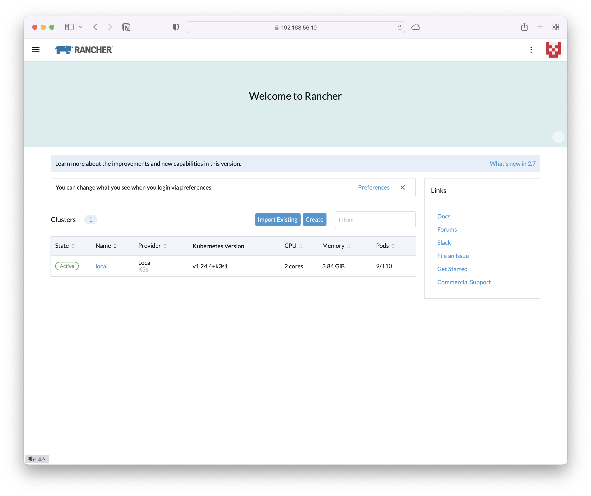

# Rancher Install

## Prerequisites

* [VirtualBox](https://www.virtualbox.org)
* [Vagrant](https://www.vagrantup.com)
* At least 4GB of gree RAM

### Note

* Vagrant will require plugins to create VirtualBox VMs. Install them with the following commands:

```bash
vagrant plugin install vagrant-vboxmanage
```

```bash
vagrant plugin install vagrant-vbguest
```


## Configuration

> my local ip address `192.168.129.106`.

### Configuration Files

below code is bootstrap provision script for all VMs.


```bash
#!/bin/bash

# Enable ssh password authentication
echo "[TASK 1] Enable ssh password authentication"
sed -i 's/^PasswordAuthentication .*/PasswordAuthentication yes/' /etc/ssh/sshd_config
echo 'PermitRootLogin yes' >> /etc/ssh/sshd_config
systemctl reload sshd

# Set Root password
echo "[TASK 2] Set root password"
echo -e "kubeadmin\nkubeadmin" | passwd root >/dev/null 2>&1


# Set Rancher
apt-get update && apt-get install -y ca-certificates curl gnupg lsb-release
mkdir -m 0755 -p /etc/apt/keyrings
curl -fsSL https://download.docker.com/linux/ubuntu/gpg | sudo gpg --dearmor -o /etc/apt/keyrings/docker.gpg
echo "deb [arch=$(dpkg --print-architecture) signed-by=/etc/apt/keyrings/docker.gpg] https://download.docker.com/linux/ubuntu \
  $(lsb_release -cs) stable" | tee /etc/apt/sources.list.d/docker.list > /dev/null

apt-get update && apt-get install -y docker-ce docker-ce-cli containerd.io docker-buildx-plugin docker-compose-plugin
apt-get install -y vim net-tools

cat <<EOF > /etc/docker/daemon.json
{
    "insecure-registries" : [ "192.168.129.106:5001" ]
}
EOF

systemctl daemon-reload && systemctl restart docker
```



below `Vagrantfile` is generate 4 VMs(1 VM is for rancher, 3 VM is for k8s).

VM network's range is `192.168.56.0/24`.


```ruby
# -*- mode: ruby -*-
# vi: set ft=ruby :

ENV['VAGRANT_NO_PARALLEL'] = 'yes'

Vagrant.configure("2") do |config|

  config.vm.provision "shell", path: "bootstrap.sh"

  NodeCount = 4

  # Kubernetes Nodes
  (1..NodeCount).each do |i|
    config.vm.define "node#{i}" do |node|

      node.vm.box = "ubuntu/focal64"
      node.vm.hostname = "node#{i}.example.com"
      node.vm.network "private_network", ip: "192.168.56.11#{i}"

      node.vm.provider "virtualbox" do |v|
        v.name = "node#{i}"
        v.memory = 2048
        v.cpus = 2
      end
    end
  end

end
```



VM Information

| hostname | cpus | memory(GiB) | IP             | Purpose    |
| -------- | ---- | ----------- | -------------- | ---------- |
| node1    | 2    | 2           | 192.168.56.111 | Rancher    |
| node2    | 2    | 2           | 192.168.56.112 | k8s Master |
| node3    | 2    | 2           | 192.168.56.113 | k8s Worker |
| node4    | 2    | 2           | 192.168.56.114 | k8s Worker |


Empty VM List

<figure><figcaption><p>Empty VM List</p></figcaption></figure>


### Build VMs

build VMs. this command is take a few minutes.

```bash
vagrant up
```


Generated VM List

<figure><figcaption><p>Generated VM List</p></figcaption></figure>

## Repository in Host

In host machine, run docker registry.


```bash
sudo docker run -d -p 5001:5000 --restart always --name registry registry:2
```


after run registry, see below command:

```bash
curl 192.168.129.106:5001/v2/_catalog
```


## Run Rancher

### Install rancher

connect `node1` with root password `kubeadmin`, see `bootstrap.sh`&#x20;


```bash
ssh root@192.168.56.111
docker run --privileged -d --restart=unless-stopped -v /opt/rancher:/var/lib/rancher -p 80:80 -p 443:443 rancher/rancher
```



```bash
root@node1:~# docker run --privileged -d --restart=unless-stopped -v /opt/rancher:/var/lib/rancher -p 80:80 -p 443:443 rancher/rancher
Unable to find image 'rancher/rancher:latest' locally
latest: Pulling from rancher/rancher
fb44d0195361: Pull complete
28e8c69365bc: Pull complete
69133ddd606f: Pull complete
552cf618daee: Downloading [=============>                                     ]  46.77MB/170.8MB
f4ccca29e2ec: Download complete
46c3a18b4dc4: Download complete
45702284aa96: Download complete
8df327249a50: Downloading [===============================================>   ]  26.37MB/27.78MB
54c378396e21: Download complete
d6ba306d9dd5: Downloading [======>                                            ]  9.128MB/70.07MB
b44793c1e7d3: Waiting
ffde21a6ab12: Waiting
aaeeb000d225: Waiting
aa421db55e87: Waiting
907c7a663008: Waiting
8745a92f349a: Waiting
a4cc830ed766: Waiting
ce5f83f3158f: Waiting
b11162943c37: Waiting
194836056959: Waiting
....
Digest: sha256:188ac186125ca1d4bef1e741568ec381eed1af4e9a876c7b15eabcc98325f2b0
Status: Downloaded newer image for rancher/rancher:latest
c5b095765135fd3154ab1474990b8e441aae192e12443b0fe9638e16d3cc97a4
root@node1:~#
```



### Rancher web

#### connect to rancher web (`http:192.168.56.111`) via web browser

<figure><figcaption><p>connect to rancher web</p></figcaption></figure>


#### check container id and find password


```bash
root@node1:~# docker ps
CONTAINER ID   IMAGE             COMMAND           CREATED         STATUS         PORTS                                                                      NAMES
c5b095765135   rancher/rancher   "entrypoint.sh"   7 minutes ago   Up 7 minutes   0.0.0.0:80->80/tcp, :::80->80/tcp, 0.0.0.0:443->443/tcp, :::443->443/tcp   hardcore_banach
root@node1:~#
root@node1:~#
root@node1:~# docker logs c5b | grep "Bootstrap Password"
I0228 06:21:49.416557      33 leaderelection.go:248] attempting to acquire leader lease kube-system/cattle-controllers...
I0228 06:21:49.434567      33 leaderelection.go:258] successfully acquired lease kube-system/cattle-controllers
E0228 06:21:50.445510      33 gvks.go:69] failed to sync schemas: unable to retrieve the complete list of server APIs: monitoring.coreos.com/v1: the server could not find the requested resource
2023/02/28 06:21:49 [INFO] Bootstrap Password: 7sw2c25v9wznztm57m5n9sdlbpqqmzw6bfrbx6lmk7hqqtgtv25wdp
E0228 06:21:51.029681      33 gvks.go:69] failed to sync schemas: unable to retrieve the complete list of server APIs: monitoring.coreos.com/v1: the server could not find the requested resource
E0228 06:21:56.122655      33 gvks.go:69] failed to sync schemas: failed to sync cache for cluster.x-k8s.io/v1alpha3, Kind=MachineHealthCheck
E0228 06:22:04.272865      33 memcache.go:206] couldn't get resource list for rke-machine-config.cattle.io/v1: the server could not find the requested resource
E0228 06:22:04.354617      33 memcache.go:206] couldn't get resource list for rke-machine.cattle.io/v1: the server could not find the requested resource
E0228 06:22:05.942253      33 gvks.go:69] failed to sync schemas: failed to sync cache for rke-machine.cattle.io/v1, Kind=AzureMachineTemplate
E0228 06:22:07.407031      33 gvks.go:69] failed to sync schemas: failed to sync cache for rke-machine.cattle.io/v1, Kind=VmwarevsphereMachine
E0228 06:22:08.286225      33 gvks.go:69] failed to sync schemas: failed to sync cache for rke-machine.cattle.io/v1, Kind=LinodeMachine
E0228 06:22:09.207585      33 request.go:977] Unexpected error when reading response body: context canceled
E0228 06:22:09.210331      33 gvks.go:69] failed to sync schemas: failed to sync cache for rke-machine.cattle.io/v1, Kind=LinodeMachineTemplate
root@node1:~#
```



#### Set new password and continue

<figure><figcaption><p>Set new password</p></figcaption></figure>

Rancher main page

<figure><figcaption><p>Rancher main page</p></figcaption></figure>


## Create New Cluster

Click Create new Cluster and select `Custom`.

> Custom: use existing nodes and create a cluster using RKE

<figure><figcaption><p>Create Cluster</p></figcaption></figure>

set `Cluster Name` and scroll down.

<figure><figcaption></figcaption></figure>

`Cloud provider` is `External (Out-of-tree)` and `Next`.

<figure><figcaption></figcaption></figure>


Add Cluster - Custom

> Click `Show advanced options`

<figure><figcaption></figcaption></figure>

Show advanced options

<figure><figcaption></figcaption></figure>

node role

* node2(192.168.56.112) is master(etcd, control plane).
* node3(192.168.56.113), node4(192.168.56.114) is worker(worker)


in node2 (select only `etcd`, `control plane` and copy command)


```bash
sudo docker run -d --privileged --restart=unless-stopped --net=host -v /etc/kubernetes:/etc/kubernetes -v /var/run:/var/run  rancher/rancher-agent:v2.7.1 --server https://192.168.56.111 --token mnb5t8g85nch64d4m95f2wdvlpcrv5lx82pcgxjd4jzm7dhmll9hng --ca-checksum 94bf5ab5d96599a7ec029e430bd2eb588bc9dd960ac676dd3b4532cba9216d6a --address 192.168.56.112 --internal-address 192.168.56.112 --etcd --controlplane
```



in node3 (deselect `etcd`, `control plane` and select only `worker` and copy command)


```bash
sudo docker run -d --privileged --restart=unless-stopped --net=host -v /etc/kubernetes:/etc/kubernetes -v /var/run:/var/run  rancher/rancher-agent:v2.7.1 --server https://192.168.56.111 --token mnb5t8g85nch64d4m95f2wdvlpcrv5lx82pcgxjd4jzm7dhmll9hng --ca-checksum 94bf5ab5d96599a7ec029e430bd2eb588bc9dd960ac676dd3b4532cba9216d6a --address 192.168.56.113 --internal-address 192.168.56.113 --worker
```



in node4 (deselect `etcd`, `control plane` and select only `worker` and copy command)


```bash
sudo docker run -d --privileged --restart=unless-stopped --net=host -v /etc/kubernetes:/etc/kubernetes -v /var/run:/var/run  rancher/rancher-agent:v2.7.1 --server https://192.168.56.111 --token mnb5t8g85nch64d4m95f2wdvlpcrv5lx82pcgxjd4jzm7dhmll9hng --ca-checksum 94bf5ab5d96599a7ec029e430bd2eb588bc9dd960ac676dd3b4532cba9216d6a --address 192.168.56.114 --internal-address 192.168.56.114 --worker
```



after few minutes. create cluster is finished.


## References






